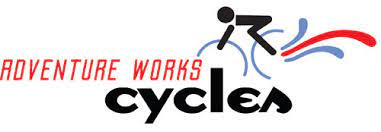
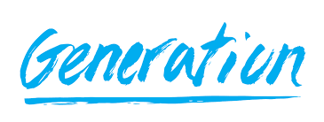

# Adventure-Works-Cycles
 

This is an Interim project I did during Generation UK&I Bootcamp, where I analysed the database and answered several business problems

- Data is taken from AdventureWorksCycles database
- Utilise SQL, Python, and data analytics skills to uncover key learnings from the dataset
- Utilized visualization skills to support findings and trends in the dataset
- Created a presentation deck and clearly communicated analytical results
- A report was generated to defend the analysis

This project includes

[Project Report](https://github.com/SadafTariq/AdventureWorksCycles/blob/main/Report.pdf)

[Python Code](https://github.com/SadafTariq/AdventureWorksCycles/blob/main/Python%20_code.ipynb)

SQL Codes:

[CODE 1](https://github.com/SadafTariq/AdventureWorksCycles/blob/main/Q1.sql)
[CODE 2](https://github.com/SadafTariq/AdventureWorksCycles/blob/main/Q2.sql)
[CODE 3](https://github.com/SadafTariq/AdventureWorksCycles/blob/main/Q3%2C4%2C5%2C6.sql)

[Adventure Works Cycle Database](https://learn.microsoft.com/en-us/sql/samples/adventureworks-install-configure?view=sql-server-ver16&tabs=ssms)

